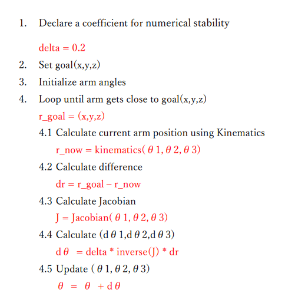
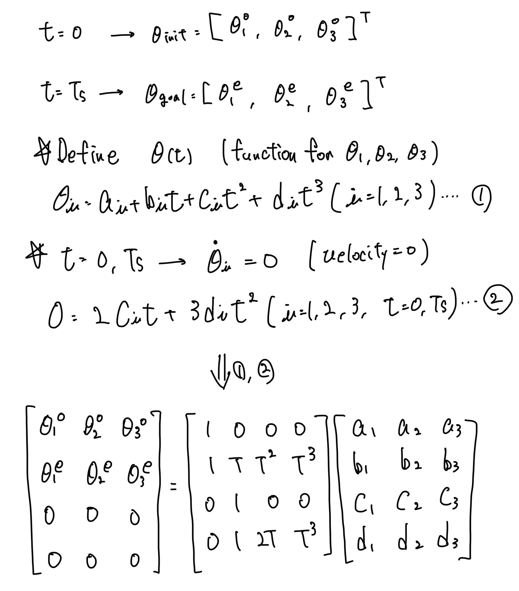

# Robot Arm Movement Visualization Using Matlab

  

## I created a animation of a robot arm moving to its input position!!

### Mathematical parts↓↓↓
### ①Model Of the Robot

  

### ② Homogeneous Transformation Matrix

  

### ③How to calculate each Position/Each Rotation Vecotr

  

### ④Inverse Kinematics Algorithm

  

### ⑤How to Calculate Trajectory

  

